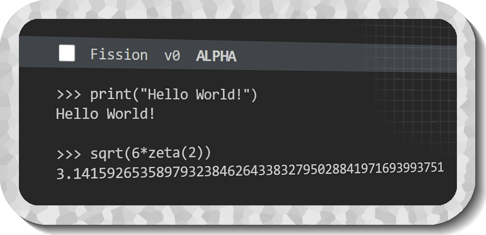
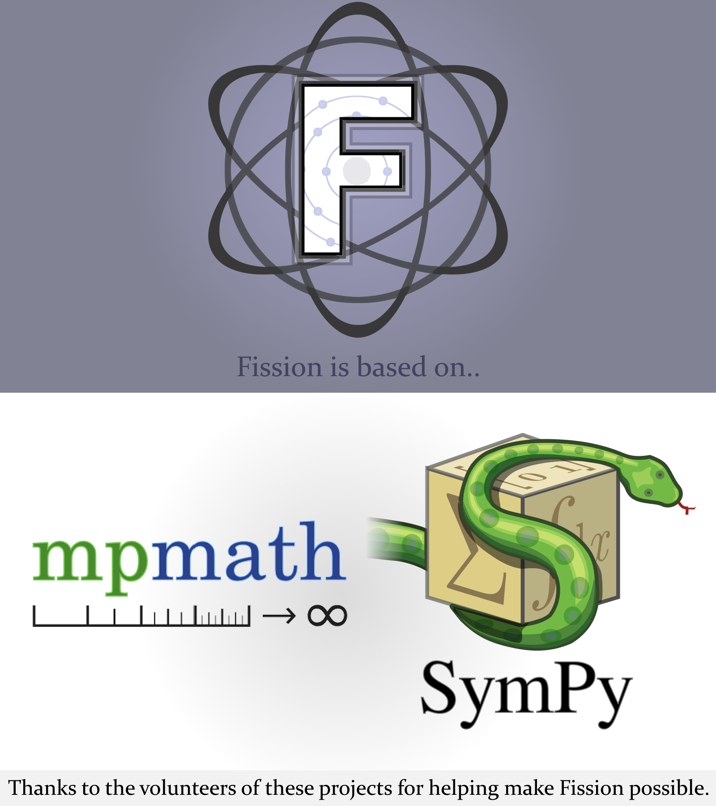

# Fission Math

<p align="center">
  
</p>

---
## Fission Alpha v0
<p align="left">
  
</p>


**Fission** is a **powerful mathematical interpreter** with support for **arbitrary precision calculation** of common math functions, while having the features of many other programming languages. 

Fission is **a secure language** and does not include any direct code execution compared to Python's *eval()* and supports many mathematical functions. Features / libraries can be toggled and you can create your own programs in Fission that support full and native high precision execution. Ex: an online math interpreter with support for calculus.


---

## Features

Fission supports Python-like syntax for doing operations on and defining data.
```
>> x = "hello world"
"hello world"
>> x.length()
11
```

Currently, lists, strings, and numbers are implemented, with support to be added for boolean expressions (True/False) and vectors (<>)

## Numbers

Numbers are a universal data type that encompass integers, floats, and complex numbers. 

You can convert any string that expresses a float, or complex number into a 'num' type.

```
>> string = "2"
"2"
>> number = 2
2
>> string = num(string)
2
>> number - string
0
```

and vice versa:
```
>> str(2)
"2"
```

You can also express numbers with "_" in the number to replace a comma (comma support is coming soon for numbers, currently conflicts with arguments)
```
>> 2_000_000
2000000
```

### Precision

Inorder to set the precision for a calculation to a given number of digits, you can use the setprec() function:
```
>> setprec(5)
Precision set to 5.0
>> pi
3.1416
>> setprec(2)
Precision set to 20.0
>> pi
3.1415926535897932385
```

You can not set the precision less than 2, and you can set the precision up to about ~ 10 million digits before time becomes a problem.
A preferable range is between 50,000 and 1 million for fast high precision calculations, although at higher precision memory usage may also be a problem.
Calculations are done with mpmath. 

```
>> setprec(1)
ValueError: Precision can not be set less than two.
>> setprec(10_000_000)
Precision set to 10000000.0
>> pi
(8.7s): 3.1415926358979323846...
```

#### Example Program

A program that asks the user for a number of digits, then saves to disk pi up to that number of digits the file `pi-{digits}`.
The program saves the current precision and restores it after the calculation. 
It also measures the time elapsed of the high precision calculation with `time.perf_counter()`.
```
// Clear the console
clear_console()
// Save the current precision
initial_precision = working_prec

print("Fission Pi Calculator")
precision = num(input("Enter precision in digits: (>2): "))
setprec(precision)
print("Starting..")
start_time = time.perf_counter()
os.save_to_disk(pi, "w+", "pi-"+str(precision)+"-digits")
end_time = time.perf_counter() - start_time
print("Success! Took " + str(round(end_time, 9)) + " seconds!")
// Revert back
setprec(initial_precision)
```

#### Additional Information

Calculations are done with mpmath and numbers are stored as either `mpf` or `mpc` types in Python. 

## Mathematical Functions

Some standard mathematical functions that are implemented include:
+ zeta(s,a)
+ sqrt(z)
+ log(x, b) (Default base is `e`)
+ exp()

With many more standard mathematical functions to come soon (Gamma(), Factorial(), etc.)
All functions that can accept imaginary values in their mathematical definition will in Fission.
```
>>> sqrt(-1)
(0+1j)
```

Expect a fully-equipped calculator after alpha. 

## Order / Calculation

<p align="center">
  
</p>
<p style="text-align: center;">
  <h4>Fission uses mpmath and sympy for high precision symbolic computation. Thanks to the developers of these projects for making Fission possible.</h4>
</p>


All expressions are evaluated in proper order in alignment with Wolfram Alpha:
```
>>> 2*4+2
10
>>> -2^2
-4
>>> (2+3)(4+5)
45
>>> 2(pi)
6.28315..
>>> pi(2)
6.28315..
>>> 2pi - 2e
0.846621650261496006
```

The age old problem surrounding "PEMDAS" and other acronyms for order is are expressions like `6 / 2(1+2)`.
According to PEMDAS, this should be evaluated like `6 / 2(1+2)` -> `6 / 2(3)` -> `6/6` = `1`, but many calculators return conflicting results.
It can also be evaluted as `(6/2)(1+2)` which would be `9` in this case.

Fission evalutes this problem like Wolfram Alpha and many other calculators do as `9`.
```
>>> 6 / 2(1+2)
9
```
Although, be aware that such notation is unclear and would not be used in practice. 


Expressions like `2+3(4+5)` are evaluated as `2 + 3*(4+5)`, and `pi^2/6` like `(pi^2)/6`.
This differs from Wolfram Alpha's notation of considering fractions as their own set (`pi^2/6` as `pi^(2/6)`). There will be an option to toggle this in the future. 
```
>>> 2+3(4+5)
29
>>> pi^2/6-zeta(2)
0
```

#### To Come Soon
+ Factorials with `!` syntax


### Imaginary Values

As the mpmath and Python native implementation of complex values is `j` for sqrt(-1) and "(a+b`j`)" for complex numbers, Fission follows the same format.
```
>>> sqrt(-1)
(0 + 1j)
>>> i
(0 + 1j)
>>> j
(0 + 1j)
```

Converting imaginary numbers to strings and vice versa also works:
```
>>> str(1+2j)
"(1 + 2j)"
>>> num("1 + 2j")
(1 + 2j)
```


- **Feature 1**: A brief description of this feature.
- **Feature 2**: Explanation of what this feature does and why it's essential.
- **Feature 3**: A quick note on the benefits of this feature.
- ... (continue listing other features)

---

## Installation

1. **Step 1**: Brief description of the first step.
2. **Step 2**: Details about the second step.
3. ... (continue listing other steps)

---

## Code Examples

```fission
// Sample code in Fission
print("Hello, Fission!")
