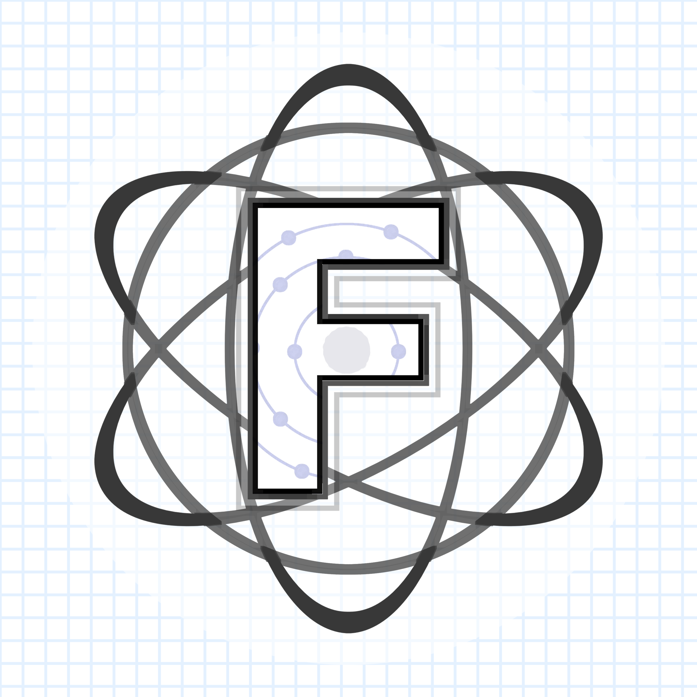

# Fission Programming Language

<p align="center">
  
</p>

---

## Fission

**Fission** is a **powerful mathematical interpreter** that supports **arbitrary precision calculation** of common math functions, while having the features of many other programming languages. 

Fission is **a secure language** and does not include any direct code execution compared to Python's *eval()* and supports many mathematical functions. Features / libraries can be toggled and you can create your own programs in Fission that support full and native high precision execution. 


---

## Features

- **Feature 1**: A brief description of this feature.
- **Feature 2**: Explanation of what this feature does and why it's essential.
- **Feature 3**: A quick note on the benefits of this feature.
- ... (continue listing other features)

---

## Installation

1. **Step 1**: Brief description of the first step.
2. **Step 2**: Details about the second step.
3. ... (continue listing other steps)

---

## Code Examples

```fission
// Sample code in Fission
print("Hello, Fission!")
